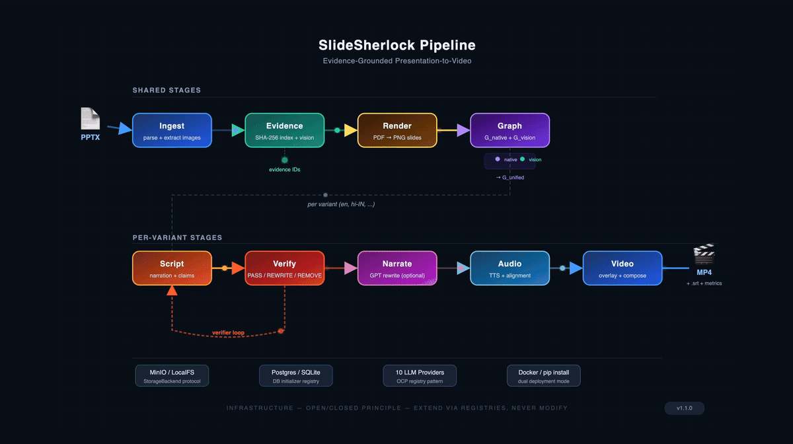

# SlideSherlock

[](https://github.com/sachinkg12/SlideSherlock/actions/workflows/ci.yml)
[](https://doi.org/10.5281/zenodo.19413323)
[](LICENSE)

**SlideSherlock** is an evidence-grounded pipeline that converts PowerPoint presentations into narrated explainer videos. Every narrated claim is traceable to specific slide content — no hallucinations, no invented facts.

## Why SlideSherlock?

Existing slide-to-video tools either read bullet points verbatim or hallucinate content that doesn't exist in the source material. SlideSherlock solves this with three novel mechanisms:

1. **Evidence Index** — Every piece of PPTX content (text, shapes, images, connectors) receives a stable, content-addressable evidence ID (`SHA-256(job|slide|kind|offset)`). All downstream narration must cite these IDs.

2. **Verifier Loop** — A closed-loop control system: generate script &rarr; verify against evidence (PASS / REWRITE / REMOVE) &rarr; regenerate &rarr; re-verify until convergence. Not post-hoc filtering — inline verification with iterative correction.

3. **Dual-Provenance Knowledge Graph** — Two independent graphs are built per slide: **G_native** from PPT XML (shapes, connectors, groups) and **G_vision** from rendered PNGs + OCR. These merge into **G_unified** where each node carries provenance (NATIVE / VISION / BOTH), confidence scores, and `needs_review` flags.

## Features

| Feature | Description |
|---------|-------------|
| **10-Stage Pipeline** | Ingest &rarr; Evidence &rarr; Render &rarr; Graph &rarr; Script &rarr; Verify &rarr; Translate &rarr; Narrate &rarr; Audio &rarr; Video |
| **AI Narration** | Optional GPT-4o(-mini) rewrite: evidence-grounded template &rarr; natural presenter delivery (two-pass, hallucination-free) |
| **Vision Understanding** | Optional GPT-4o vision extractor for photo captions, diagram entities, and OCR — cached by image hash |
| **Quality Presets** | Draft (fast), Standard (subtitles + crossfade), Pro (vision AI + BGM + loudness normalization) |
| **Multi-Language** | Generate variants from one PPTX. Shared evidence and graphs; only language-dependent stages re-run |
| **Web UI** | React Mission Control dashboard: pipeline track, focus panel, activity feed, dark/light theme, color-blind safe |
| **CLI** | `slidesherlock run deck.pptx --preset pro --ai-narration` with structured JSON logging for experiments |
| **Docker** | `docker compose up` &mdash; one command for the full 6-service stack |
| **167 Tests** | Automated test suite covering evidence grounding, verification, graph fusion, and pipeline stages |

## Quick Start

### Docker (recommended)

```bash
git clone https://github.com/sachinkg12/SlideSherlock.git
cd SlideSherlock
cp .env.example .env       # Add your OPENAI_API_KEY (optional; stub used otherwise)
docker compose up           # Starts API, worker, Postgres, Redis, MinIO, pgAdmin
```

- **API**: http://localhost:8000
- **API Docs** (interactive): http://localhost:8000/docs (Swagger UI) or http://localhost:8000/redoc (ReDoc)
- **Web UI**: http://localhost:3000 (if running `pnpm dev` in `apps/web/`)

### Local Development

```bash
make setup                  # Create venv + install deps
make up                     # Start Postgres, Redis, MinIO (Docker)
make migrate                # Run database migrations
make api                    # Start FastAPI server (port 8000)
make worker                 # Start pipeline worker (separate terminal)
```

### CLI (no Redis/RQ needed)

```bash
slidesherlock run deck.pptx                                  # Draft preset, output to ./output/
slidesherlock run deck.pptx --preset pro -o results/         # Pro preset, custom output
slidesherlock run deck.pptx --preset pro --ai-narration      # Enable GPT-4o narration rewrite
slidesherlock run deck.pptx --preset standard --lang hi-IN   # Add Hindi second-language variant
slidesherlock run deck.pptx --preset pro --dry-run             # Metrics only, no audio/video
slidesherlock doctor                                          # Check system dependencies
slidesherlock doctor --json                                   # Machine-readable JSON output
```

Each CLI run produces `metrics.json` and `run_log.json` (structured log for experiment aggregation). Full runs also produce `final.mp4`. Use `--dry-run` for quick validation without video encode.

### Local LLM (no API key needed)

SlideSherlock supports 10 OpenAI-compatible LLM providers. To use [Ollama](https://ollama.com) for fully local operation:

```bash
# Install and start Ollama
ollama pull llama3.1:8b        # text model for narration
ollama pull llava:7b            # vision model for image understanding

# Run SlideSherlock with Ollama
LLM_PROVIDER=ollama slidesherlock run deck.pptx --preset pro --ai-narration
```

Other supported providers: OpenAI, Groq, Together, OpenRouter, DeepInfra, Anyscale, LM Studio, vLLM, LocalAI. See `packages/core/llm_config.py` for the full registry.

## Architecture



The pipeline follows the **Open/Closed Principle**: each stage implements a `Stage` protocol. Adding a new stage requires no changes to existing code — just add a class and register it.

```python
class Stage(Protocol):
    name: str
    def run(self, ctx: PipelineContext) -> StageResult: ...
```

## Pipeline Stages

| Stage | Key Modules | Output |
|-------|-------------|--------|
| **Ingest** | `ppt_parser`, `image_extract`, `image_classifier` | `ppt/slide_*.json`, `images/` |
| **Evidence** | `evidence_index`, `photo_understand`, `diagram_understand` | `evidence/index.json` |
| **Render** | LibreOffice + pdf2image | `render/deck.pdf`, `render/slides/*.png` |
| **Graph** | `native_graph`, `vision_graph`, `merge_engine` | `graphs/unified/slide_*.json` |
| **Script** | `explain_plan`, `script_generator`, `script_context` | `script/{variant}/script.json` |
| **Verify** | `verifier` (closed-loop rewrite) | `verify_report.json`, `coverage.json` |
| **Translate** | `translator_provider` (l2 variants only) | Translated script + notes |
| **Narrate** | `narrate` (GPT-4o, optional) | `ai_narration.json` |
| **Audio** | `audio_prepare`, `tts_provider` | `audio/{variant}/slide_*.wav` |
| **Video** | `timeline_builder`, `overlay_renderer`, `composer` | `output/{variant}/final.mp4` |

## No-Hallucination Design

```
         ┌──────────────────────────────────────────────┐
         │            Evidence Index                      │
         │  SHA-256(job|slide|kind|offset) → source_ref  │
         └──────────────────┬───────────────────────────┘
                            │
                            ▼
┌──────────┐    ┌──────────────────┐    ┌───────────┐
│  Script   │───▶│  Verifier Loop   │───▶│  Verified  │
│ Generator │    │                  │    │  Script    │
│           │◀───│ PASS → keep      │    │           │
│ (claims   │    │ REWRITE → regen  │    │ (all claims│
│  cite     │    │ REMOVE → drop    │    │  grounded) │
│  evidence)│    │                  │    │           │
└──────────┘    └──────────────────┘    └───────────┘
                  max 3 iterations
```

Image claims must specifically cite `IMAGE_*` or `DIAGRAM_*` evidence kinds. The verifier enforces this — no generic claims about visual content without supporting vision evidence.

## AI Narration

SlideSherlock includes a **dedicated NarrateStage** that produces natural presenter-style narration without sacrificing the no-hallucination guarantee. It uses a **two-pass design**:

1. **Pass 1 — Evidence-grounded template.** The deterministic script generator produces narration where every sentence cites evidence IDs. The verifier loop validates and rewrites until every claim is grounded.
2. **Pass 2 — Natural rewrite.** GPT-4o(-mini) rewrites each verified segment for natural delivery, but is constrained to the validated factual content. No new claims can be introduced — the rewriter only changes phrasing, rhythm, and pronunciation.

NarrateStage uses `requests` directly (not the `openai` SDK) because the SDK's `httpx` transport deadlocks inside RQ-forked workers.

**Configuration:**

| Variable | Default | Purpose |
|----------|---------|---------|
| `OPENAI_API_KEY` | _(unset)_ | Required to enable AI narration |
| `LLM_PROVIDER` | `stub` | Set to `openai` to activate, or use the UI/CLI flag |
| `NARRATE_MODEL` | `gpt-4o-mini` | Override to `gpt-4o` for highest quality |
| `NARRATE_PARALLEL` | `5` | Concurrent rewrite calls (per slide) |

**Cost estimates:**

| Model | Cost per slide | 16-slide deck |
|-------|---------------|---------------|
| `gpt-4o-mini` (default) | ~$0.001 | ~$0.02 |
| `gpt-4o` (full) | ~$0.01 | ~$0.16 |

**Three ways to enable:**
- Web UI &mdash; **AI Narration toggle** on the upload page
- CLI &mdash; `slidesherlock run deck.pptx --ai-narration`
- Env &mdash; export `LLM_PROVIDER=openai` before starting the worker (with `OPENAI_API_KEY`)

## Vision Understanding

The **OpenAIVisionExtractor** optionally enriches each slide with computer vision:

- **Default:** stub provider — no API calls, deterministic output, free
- **Real vision:** set `VISION_PROVIDER=openai` + `OPENAI_API_KEY`
- **Default vision model:** `gpt-4o-mini` (override with `OPENAI_VISION_MODEL=gpt-4o`)
- **Vision cache:** enabled by default; results cached by image SHA-256 in MinIO to avoid duplicate API calls across re-runs

For each slide image the vision extractor produces:

- **Photo captions** — natural-language description of photographic content
- **Diagram entities** — boxes, arrows, labels, and their spatial relationships
- **OCR text** — text rendered as images (chart labels, callouts, decorative type)

All vision-derived facts are written to the evidence index with `IMAGE_*` / `DIAGRAM_*` kinds, so the verifier can ground image-related claims to them.

## Configuration

All configuration is environment-variable driven. Copy `.env.example` to `.env` for local development; for Docker, infra vars are pre-configured in `docker-compose.yml`.

### LLM

| Variable | Default | Purpose |
|----------|---------|---------|
| `OPENAI_API_KEY` | _(unset)_ | API key for LLM, vision, and narration |
| `LLM_PROVIDER` | `stub` | `stub` (deterministic) or `openai` (enables AI narration) |
| `NARRATE_MODEL` | `gpt-4o-mini` | Narration rewrite model |
| `NARRATE_PARALLEL` | `5` | Parallel narration calls per slide |

### Vision

| Variable | Default | Purpose |
|----------|---------|---------|
| `VISION_PROVIDER` | `stub` | `stub` or `openai` |
| `OPENAI_VISION_MODEL` | `gpt-4o-mini` | Vision extractor model |
| `VISION_CACHE_ENABLED` | `true` | Cache vision results by image hash |
| `VISION_PHOTO_CONFIDENCE` | `0.6` | Min confidence for photo captions |
| `VISION_DIAGRAM_CONFIDENCE` | `0.6` | Min confidence for diagram entities |
| `VISION_OCR_CONFIDENCE` | `0.5` | Min confidence for OCR text |

### TTS

| Variable | Default | Purpose |
|----------|---------|---------|
| `USE_SYSTEM_TTS` | `false` | macOS system TTS via `say` (avoids pyttsx3 fork hang) |
| `AUDIO_VOICE_PROVIDER` | `stub` | `stub`, `system`, or future cloud providers |

### Video

| Variable | Default | Purpose |
|----------|---------|---------|
| `VIDEO_TRANSITION` | `cut` | `cut` or `crossfade` between slides |
| `VIDEO_INTRO_ENABLED` | `false` | Show intro card |
| `VIDEO_OUTRO_ENABLED` | `false` | Show outro card |
| `AUDIO_BGM_ENABLED` | `false` | Background music bed |
| `AUDIO_BGM_DUCK_DB` | `-18` | dB to duck BGM under narration |
| `AUDIO_LOUDNESS_NORM` | `false` | EBU R128 loudness normalization |

### Subtitles

| Variable | Default | Purpose |
|----------|---------|---------|
| `SUBTITLES_ENABLED` | `false` | Generate `.srt` sidecar |
| `SUBTITLES_BURN_IN` | `false` | Burn subtitles into the video frame |

### Presets

| Variable | Default | Purpose |
|----------|---------|---------|
| `SLIDESHERLOCK_PRESET` | `draft` | `draft`, `standard`, or `pro` (sets all video/audio/subtitle/vision flags) |

## API Endpoints

| Endpoint | Method | Purpose |
|----------|--------|---------|
| `/jobs/quick` | POST | Upload PPTX + create project + start pipeline (one step) |
| `/jobs` | POST | Create a job (advanced) |
| `/jobs/{id}` | GET | Job status |
| `/jobs/{id}/upload_pptx` | POST | Upload PPTX to existing job |
| `/jobs/{id}/progress` | GET | Per-stage progress for UI polling |
| `/jobs/{id}/metrics` | GET | Pipeline metrics (durations, counts, coverage) |
| `/jobs/{id}/evidence-trail` | GET | Live verifier decisions (PASS/REWRITE/REMOVE) |
| `/jobs/{id}/output/{variant}/final.mp4` | GET | Stream video (HTTP Range support for seeking) |
| `/jobs/{id}/output/{path}` | GET | Stream any artifact under `jobs/{id}/` from MinIO |
| `/projects` | POST | Create a project |
| `/projects/{id}` | GET | Get project |
| `/health` | GET | Health check |

## Web UI

React 18 + TypeScript + Vite + Tailwind CSS + Framer Motion. **Mission Control** design with dark/light theme support.

```bash
cd apps/web && pnpm install && pnpm dev    # http://localhost:3000
```

> Note: the web app uses **pnpm** (not npm). It also auto-enters demo mode if the backend is unreachable, or visit `/?demo=true`.

**Three screens:**

1. **Upload** &mdash; Drag-drop PPTX, preset selector (draft/standard/pro), **AI Narration toggle**
2. **Progress** &mdash; Mission Control: horizontal pipeline track + focus panel + activity feed + confetti on completion
3. **Result** &mdash; Pipeline report, video player with seek-drag and volume slider, download buttons

**Mission Control layout:**

- **PipelineTrack** &mdash; horizontal flow of stage dots connected by animated lines; the active stage pulses
- **FocusPanel** &mdash; large card for the current stage with rotating icon, live status text, and per-stage metrics
- **ActivityFeed** &mdash; timestamped event log: stage start/finish events plus verifier verdicts (PASS/REWRITE/REMOVE)
- **ThemeToggle** &mdash; sun/moon button in the header; preference persisted to `localStorage`
- **VideoPlayer** &mdash; custom component with seek-drag, volume slider, and playback controls

**Accessibility:**

- **Color-blind safe palette** &mdash; blue/orange (not red/green), shape and icon indicators primary, color secondary (WCAG 1.4.1 compliant)
- **Dark and light themes** &mdash; full CSS custom-property theming
- **Keyboard navigation** &mdash; all interactive elements reachable via tab

The stage registry in `apps/web/src/config/stages.ts` follows the Open/Closed Principle: adding a new pipeline stage to the UI requires only one new entry — PipelineTrack, FocusPanel, and ActivityFeed all derive from this registry.

## Quality Presets

| Feature | Draft | Standard | Pro |
|---------|-------|----------|-----|
| Vision (OpenAI) | Off | Off | **On** |
| AI Narration | Off (orthogonal) | Off (orthogonal) | Off (orthogonal) |
| Notes Overlay | Off | On | On |
| Transitions | Cut | Crossfade | Crossfade |
| Subtitles | Off | On (sidecar) | On (sidecar) |
| Intro / Outro | Off | On | On |
| Background Music | Off | Off | On (ducked under narration) |
| Loudness Normalization | Off | EBU R128 | EBU R128 |
| Typical runtime (16 slides) | ~30s | ~60s | ~3 min |

AI Narration is **orthogonal** to presets &mdash; toggle it independently to enable the GPT-4o natural delivery rewrite on top of any preset.

```bash
SLIDESHERLOCK_PRESET=pro make worker        # Pro preset
SLIDESHERLOCK_PRESET=draft make worker      # Draft preset
```

## Testing

```bash
make test               # 152 tests across core pipeline and API
make lint               # black --check + flake8 (max-line-length=100)
make doctor             # Check LibreOffice, FFmpeg, Poppler, Tesseract
```

## Batch Experiments

Run the pipeline on a corpus of PPTXs for paper data collection:

```bash
python scripts/batch_run.py /path/to/pptx_dir --preset draft --workers 3 --output results/
```

Produces `batch_summary.json` and `batch_summary.csv` (one row per file, stage timings as columns) for direct use in paper tables.

## Deployment

### Docker Compose (local or VM)

```bash
docker compose up
```

This starts **6 services**:

| Service | Port | Purpose |
|---------|------|---------|
| `postgres` | 5433 | Job + artifact metadata |
| `redis` | 6379 | RQ job queue |
| `minio` | 9000/9001 | S3-compatible artifact storage |
| `pgadmin` | 5050 | Postgres web UI |
| `api` | 8000 | FastAPI service |
| `worker` | &mdash; | RQ worker running the 10-stage pipeline |

The Dockerfile bundles all system dependencies (LibreOffice, FFmpeg, Poppler, Tesseract).

### GCP Compute Engine (production demo)

Recommended VM: **e2-medium** (2 vCPU, 4 GB RAM) — covered by the GCP $200 free credit for several months. Zero code changes:

```bash
gcloud compute ssh slidesherlock-vm
git clone https://github.com/sachinkg12/SlideSherlock.git
cd SlideSherlock && cp .env.example .env && docker compose up -d
```

Open ports `8000` (API) and `3000` (Web UI). Pre-loaded demo mode (read-only) is recommended for public reviewer access.

## System Dependencies

Checked via `make doctor`. All bundled in the Docker image.

| Dependency | Purpose | Install |
|------------|---------|---------|
| **LibreOffice** | PPTX &rarr; PDF | `brew install --cask libreoffice` |
| **FFmpeg** | Video composition | `brew install ffmpeg` |
| **Poppler** | PDF &rarr; PNG | `brew install poppler` |
| **Tesseract** | OCR (vision graph) | `brew install tesseract` |

## Citation

If you use SlideSherlock in your research, please cite:

```bibtex
@software{gupta_slidesherlock_2026,
  author    = {Gupta, Sachin},
  title     = {SlideSherlock: Evidence-Grounded Presentation-to-Video Pipeline},
  year      = {2026},
  doi       = {10.5281/zenodo.19413324},
  url       = {https://github.com/sachinkg12/SlideSherlock},
  license   = {Apache-2.0}
}
```

## License

[Apache License 2.0](LICENSE)

Copyright 2026 Sachin Gupta
