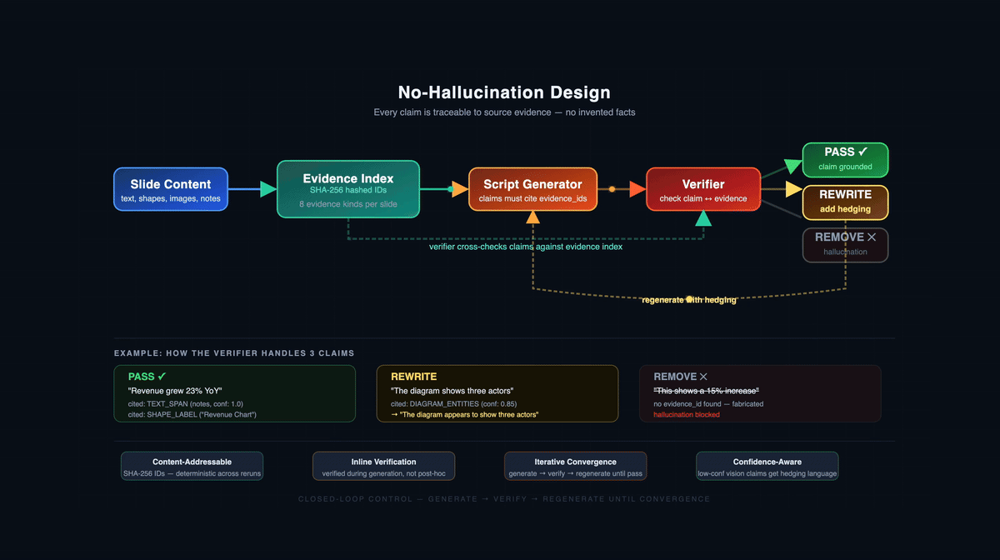

# SlideSherlock

[](https://github.com/sachinkg12/SlideSherlock/actions/workflows/ci.yml)
[](https://pypi.org/project/slidesherlock/)
[](https://doi.org/10.5281/zenodo.19413323)
[](LICENSE)

**SlideSherlock** converts PowerPoint presentations into narrated explainer videos. Every narrated claim is traced back to specific slide content — no hallucinations, no invented facts.

**39 languages** supported. Works with **Docker** or as a standalone **pip install** (no Docker needed).

---

## Quick Start

### Option 1: pip install (simplest, no Docker needed)

```bash
pip install slidesherlock
```

**Prerequisites:** [LibreOffice](https://www.libreoffice.org/download/), [FFmpeg](https://ffmpeg.org/download.html), and [Poppler](https://poppler.freedesktop.org/) must be installed on your system. Check with:

```bash
slidesherlock doctor
```

**Run your first video:**

```bash
slidesherlock run your_presentation.pptx --preset draft -o output/
open output/final.mp4
```

That's it. No API key needed for the basic draft preset.

**Want AI-powered natural narration?** Add your OpenAI API key:

```bash
export OPENAI_API_KEY=sk-your-key-here
slidesherlock run your_presentation.pptx --preset pro --ai-narration -o output/
```

### Option 2: Docker (full stack with web UI)

```bash
git clone https://github.com/sachinkg12/SlideSherlock.git
cd SlideSherlock
cp .env.example .env       # Add your OPENAI_API_KEY (optional)
docker compose up -d        # Starts API, worker, Postgres, Redis, MinIO, pgAdmin
```

Open http://localhost:8000/health to verify. Then:

- **Web UI**: Start the frontend with `cd apps/web && pnpm install && pnpm dev`, then open http://localhost:3000
- **API Docs**: http://localhost:8000/docs (Swagger UI) or http://localhost:8000/redoc (ReDoc)

### Option 3: Local development

```bash
git clone https://github.com/sachinkg12/SlideSherlock.git
cd SlideSherlock
make setup                  # Create venv + install deps
make up                     # Start Postgres, Redis, MinIO via Docker
make migrate                # Run database migrations
make api                    # Start FastAPI server (port 8000)
make worker                 # Start pipeline worker (separate terminal)
```

---

## Why SlideSherlock?

Existing slide-to-video tools either read bullet points verbatim or hallucinate content that doesn't exist in the source material. SlideSherlock solves this with three mechanisms:

1. **Evidence Index** — Every piece of PPTX content (text, shapes, images, connectors) receives a stable, content-addressable evidence ID (`SHA-256(job|slide|kind|offset)`). All downstream narration must cite these IDs.

2. **Verifier Loop** — A closed-loop control system: generate script &rarr; verify against evidence (PASS / REWRITE / REMOVE) &rarr; regenerate &rarr; re-verify until convergence. Not post-hoc filtering — inline verification with iterative correction.

3. **Dual-Provenance Knowledge Graph** — Two independent graphs are built per slide: **G_native** from PPT XML (shapes, connectors, groups) and **G_vision** from rendered PNGs + OCR. These merge into **G_unified** where each node carries provenance (NATIVE / VISION / BOTH), confidence scores, and `needs_review` flags.

---

## Features

| Feature | Description |
|---------|-------------|
| **10-Stage Pipeline** | Ingest &rarr; Evidence &rarr; Render &rarr; Graph &rarr; Script &rarr; Verify &rarr; Translate &rarr; Narrate &rarr; Audio &rarr; Video |
| **AI Narration** | Optional GPT-4o(-mini) rewrite: evidence-grounded template &rarr; natural presenter delivery (two-pass, hallucination-free) |
| **39 Languages** | Narration in English, Hindi, Spanish, French, Chinese, Japanese, Korean, Arabic, and 31 more. macOS neural voices for natural speech. |
| **Vision Understanding** | Optional GPT-4o vision extractor for photo captions, diagram entities, and OCR — cached by image hash |
| **Quality Presets** | Draft (fast), Standard (subtitles + crossfade), Pro (vision AI + BGM + loudness normalization) |
| **CC Subtitles** | `.srt` subtitle files generated for every video. Web UI has a CC toggle button with Netflix-style display. |
| **Evidence Report** | Auto-generated HTML report showing per-slide claims, evidence citations, and verifier verdicts (PASS/REWRITE/REMOVE). Downloadable from web UI. |
| **Web UI** | React Mission Control dashboard: upload, real-time pipeline progress, video player with CC, language tabs, evidence report download |
| **CLI** | `slidesherlock run deck.pptx --preset pro --ai-narration --lang hi-IN` |
| **PyPI** | `pip install slidesherlock` — no Docker, no Postgres, no Redis needed. Uses SQLite + local filesystem. |
| **Docker** | `docker compose up` &mdash; one command for the full 6-service stack |
| **167 Tests** | Automated test suite covering evidence grounding, verification, graph fusion, and pipeline stages |

---

## Architecture


The pipeline follows the **Open/Closed Principle**: each stage implements a `Stage` protocol. Adding a new stage requires no changes to existing code — just add a class and register it.

```python
class Stage(Protocol):
    name: str
    def run(self, ctx: PipelineContext) -> StageResult: ...
```

## Pipeline Stages

| Stage | What it does | Output |
|-------|-------------|--------|
| **Ingest** | Parses PPTX: extracts text, shapes, images, connectors, speaker notes | `ppt/slide_*.json`, `images/` |
| **Evidence** | Builds evidence index with SHA-256 IDs. Optionally runs vision LLM on images for captions, diagram entities, OCR. | `evidence/index.json` |
| **Render** | Converts PPTX to PDF via LibreOffice, then to PNG slides via Poppler | `render/deck.pdf`, `render/slides/*.png` |
| **Graph** | Builds G_native (from PPT XML) and G_vision (from rendered PNGs). Merges into G_unified with dual provenance. | `graphs/unified/slide_*.json` |
| **Script** | Generates narration script where every claim cites evidence IDs | `script/{variant}/script.json` |
| **Verify** | Closed-loop verifier: checks each claim against evidence. PASS (grounded), REWRITE (add hedging), REMOVE (hallucination). Iterates until convergence. | `verify_report.json`, `coverage.json` |
| **Translate** | Translates script to target language(s) via GPT. Only runs for non-English variants. | Translated script + notes |
| **Narrate** | Optional GPT rewrite for natural presenter delivery. Preserves all verified facts. For non-English variants, outputs in the target language. | `ai_narration.json` |
| **Audio** | Text-to-speech per slide. Uses macOS neural voices (39 languages) or OpenAI TTS API. | `audio/{variant}/slide_*.wav` |
| **Video** | Renders slide overlays, composes final video with audio, subtitles, optional crossfade/intro/outro/BGM. | `output/{variant}/final.mp4` |

---

## No-Hallucination Design



The verifier checks every narration claim against the evidence index. Claims grounded in evidence **PASS**. Claims about visual content with low confidence get **REWRITE** (hedging language added, e.g., "appears to show"). Claims with no supporting evidence are **REMOVE**d — fabricated content is never narrated. The loop iterates until all claims converge.

---

## Multi-Language Narration

SlideSherlock supports **39 languages** for narration. When you select a non-English language, the pipeline:

1. Translates the verified script to the target language (via GPT)
2. Rewrites for natural delivery in that language
3. Generates audio using the appropriate macOS neural voice (e.g., Lekha for Hindi, Tingting for Chinese)
4. Produces a separate video file per language

### CLI

```bash
# Single additional language (produces English + Hindi videos)
slidesherlock run deck.pptx --preset pro --ai-narration --lang hi-IN -o output/

# Multiple languages (produces English + Hindi + Spanish + French videos)
slidesherlock run deck.pptx --preset pro --ai-narration --lang hi-IN,es-ES,fr-FR -o output/
```

Output files: `final_en.mp4`, `final_l2.mp4`, `final_l3.mp4`, etc.

### Web UI

On the upload page, click **"+ Add language"** dropdown to select additional languages. Selected languages appear as removable tag chips. English is always included. On the result page, click the language tabs to switch between variants.

### Supported languages

English, Chinese (Mandarin), Hindi, Spanish, Arabic, French, Bengali, Portuguese (Brazil), Indonesian, Russian, German, Japanese, Vietnamese, Telugu, Turkish, Tamil, Cantonese, Korean, Thai, Italian, Kannada, Polish, Dutch, Swedish, Ukrainian, Hebrew, Czech, Hungarian, Greek, Romanian, Finnish, Danish, Norwegian, Croatian, Slovak, Bulgarian, Catalan, Slovenian, Malay.

> **Note:** Languages without macOS TTS support (Urdu, Marathi, Swahili, Punjabi, Persian, Tagalog, and others) are not yet available. These would need OpenAI TTS API or Google Cloud TTS — contributions welcome.

---

## AI Narration

SlideSherlock includes a **dedicated NarrateStage** that produces natural presenter-style narration without sacrificing the no-hallucination guarantee. It uses a **two-pass design**:

1. **Pass 1 — Evidence-grounded template.** The deterministic script generator produces narration where every sentence cites evidence IDs. The verifier loop validates and rewrites until every claim is grounded.
2. **Pass 2 — Natural rewrite.** GPT-4o(-mini) rewrites each verified segment for natural delivery, but is constrained to the validated factual content. No new claims can be introduced — the rewriter only changes phrasing, rhythm, and pronunciation.

**Cost estimates (GPT-4o-mini):** ~$0.001 per slide, ~$0.02 for a 16-slide deck.

**Three ways to enable:**
- **Web UI** &mdash; AI Narration toggle on the upload page
- **CLI** &mdash; `slidesherlock run deck.pptx --ai-narration`
- **Environment** &mdash; `export OPENAI_API_KEY=sk-...` (auto-detected when key is present)

---

## CLI Reference

```bash
# Basic usage (draft preset, no API key needed)
slidesherlock run deck.pptx -o output/

# Pro preset with AI narration
slidesherlock run deck.pptx --preset pro --ai-narration -o output/

# Multi-language
slidesherlock run deck.pptx --preset pro --ai-narration --lang hi-IN,es-ES -o output/

# Dry run (metrics + evidence only, no audio/video — much faster)
slidesherlock run deck.pptx --preset pro --dry-run -o output/

# Check system dependencies
slidesherlock doctor
slidesherlock doctor --json    # Machine-readable output

# Show preset settings
slidesherlock preset pro
```

### Output files

Each run produces these files in the output directory:

| File | Description |
|------|-------------|
| `final.mp4` (or `final_en.mp4`, `final_l2.mp4`) | The narrated video(s) |
| `final.srt` | Subtitle file (sentence-level cues) |
| `metrics.json` | Pipeline timing and stage metrics |
| `run_log.json` | Structured log for experiment aggregation |
| `evidence_index.json` | All evidence items with SHA-256 IDs |
| `coverage.json` | Verifier stats: total claims, pass/rewrite/remove counts |
| `verify_report.json` | Per-claim verifier decisions and reasons |
| `evidence_report.html` | Visual HTML report (open in browser) |
| `ai_narration.json` | AI rewrite details per slide (when `--ai-narration` is used) |
| `narration_per_slide.json` | Final narration text per slide |

---

## Local LLM (no API key needed)

SlideSherlock supports **10 OpenAI-compatible LLM providers**. To use [Ollama](https://ollama.com) for fully local operation (no API key, no cloud calls):

```bash
# Install Ollama and pull models
ollama pull llama3.1:8b        # text model for narration
ollama pull llava:7b            # vision model for image understanding

# Run SlideSherlock with Ollama
LLM_PROVIDER=ollama slidesherlock run deck.pptx --preset pro --ai-narration -o output/
```

Other supported providers: **OpenAI, Groq, Together, OpenRouter, DeepInfra, Anyscale, LM Studio, vLLM, LocalAI**. See `packages/core/llm_config.py` for the full registry. Adding a new provider is one dict entry.

---

## Vision Understanding

The vision pipeline optionally enriches each slide with computer vision (requires `OPENAI_API_KEY`):

- **Photo captions** — natural-language description of photographic content
- **Diagram entities** — boxes, arrows, labels, and their spatial relationships
- **OCR text** — text rendered as images (chart labels, callouts, decorative type)

All vision-derived facts are written to the evidence index with `IMAGE_*` / `DIAGRAM_*` kinds, so the verifier can ground image-related claims to them.

**Enable:** use Pro preset (`--preset pro`) or set `VISION_PROVIDER=openai`. Results are cached by image SHA-256, so re-runs don't re-call the API.

---

## Quality Presets

| Feature | Draft | Standard | Pro |
|---------|-------|----------|-----|
| Vision (OpenAI) | Off | Off | **On** |
| Transitions | Cut | Crossfade | Crossfade |
| Subtitles (.srt) | On | On | On |
| Intro / Outro cards | Off | On | On |
| Background Music | Off | Off | On (ducked under narration) |
| Loudness Normalization | Off | EBU R128 | EBU R128 |
| Typical runtime (16 slides) | ~30s | ~60s | ~3 min |

**AI Narration** is independent of presets — toggle it on/off with any preset.

---

## Web UI

React 18 + TypeScript + Vite + Tailwind CSS + Framer Motion. **Mission Control** design with dark/light theme support.

```bash
cd apps/web && pnpm install && pnpm dev    # http://localhost:3000
```

> **Note:** The web app uses **pnpm** (not npm). It auto-enters demo mode if the backend is unreachable, or visit `/?demo=true`.

**Three screens:**

1. **Upload** &mdash; Drag-drop PPTX, preset selector, AI Narration toggle, language selector (multi-select with tag chips)
2. **Progress** &mdash; Mission Control: horizontal pipeline track, focus panel, activity feed, live stage progress
3. **Result** &mdash; Video player with CC subtitle toggle, language tabs (for multi-language jobs), Download Video button, Evidence Report download, pipeline metrics

**Accessibility:**

- Color-blind safe palette (WCAG 1.4.1 compliant)
- Dark and light themes
- Keyboard navigation for all controls

---

## Configuration

All configuration is environment-variable driven. Copy `.env.example` to `.env` for local development. Docker users: infrastructure vars are pre-configured in `docker-compose.yml`.

| Variable | Default | Purpose |
|----------|---------|---------|
| `OPENAI_API_KEY` | _(unset)_ | API key for AI narration, vision, and translation |
| `SLIDESHERLOCK_PRESET` | `draft` | Quality preset: `draft`, `standard`, or `pro` |
| `LLM_PROVIDER` | auto-detect | `stub` (no API), `openai`, `ollama`, etc. Auto-detects from API key. |
| `NARRATE_MODEL` | `gpt-4o-mini` | Narration rewrite model |
| `VISION_PROVIDER` | `stub` | `stub` or `openai` (Pro preset sets this automatically) |
| `USE_SYSTEM_TTS` | `true` | Use macOS `say` for TTS (recommended). Set `false` for pyttsx3. |
| `DATABASE_URL` | `postgresql://...` | Database connection. Use `sqlite:///path/to.db` for pip install mode. |
| `STORAGE_BACKEND` | auto-detect | `minio` (Docker) or `local` (auto-paired with SQLite) |

See the full configuration reference in the [Configuration section of the docs](https://github.com/sachinkg12/SlideSherlock#configuration).

---

## API Endpoints

| Endpoint | Method | Purpose |
|----------|--------|---------|
| `/health` | GET | Health check |
| `/languages` | GET | List supported narration languages (39) |
| `/jobs/quick` | POST | Upload PPTX + create project + start pipeline (one step) |
| `/jobs/{id}/progress` | GET | Per-stage progress for UI polling |
| `/jobs/{id}/metrics` | GET | Pipeline metrics |
| `/jobs/{id}/variants` | GET | List available language variants for a job |
| `/jobs/{id}/evidence-report` | GET | Download evidence trail HTML report |
| `/jobs/{id}/output/{variant}/final.mp4` | GET | Stream video (HTTP Range support). Add `?download=1` for file download. |
| `/jobs/{id}/output/{variant}/subtitles.vtt` | GET | WebVTT subtitles for CC player |
| `/jobs/{id}/output/{path}` | GET | Stream any artifact |

Interactive API documentation: http://localhost:8000/docs (Swagger UI)

---

## System Dependencies

These must be installed separately (pip cannot install them). All are bundled in the Docker image.

| Dependency | Purpose | macOS | Ubuntu/Debian | Check |
|------------|---------|-------|---------------|-------|
| **Python 3.11+** | Runtime | `brew install python@3.11` | `apt install python3.11` | `python3 --version` |
| **LibreOffice** | PPTX &rarr; PDF conversion | `brew install --cask libreoffice` | `apt install libreoffice-nogui` | `libreoffice --version` |
| **FFmpeg** | Video composition | `brew install ffmpeg` | `apt install ffmpeg` | `ffmpeg -version` |
| **Poppler** | PDF &rarr; PNG slides | `brew install poppler` | `apt install poppler-utils` | `pdftoppm -v` |
| **Tesseract** (optional) | OCR for vision graph | `brew install tesseract` | `apt install tesseract-ocr` | `tesseract --version` |

Run `slidesherlock doctor` to verify all dependencies are installed.

---

## Deployment

### Docker Compose (local or VM)

```bash
docker compose up -d
```

This starts **6 services**:

| Service | Port | Purpose |
|---------|------|---------|
| `postgres` | 5433 | Job + artifact metadata |
| `redis` | 6379 | RQ job queue |
| `minio` | 9000/9001 | S3-compatible artifact storage |
| `pgadmin` | 5050 | Postgres web UI |
| `api` | 8000 | FastAPI service |
| `worker` | &mdash; | RQ worker running the 10-stage pipeline |

### GCP Compute Engine

Recommended VM: **e2-standard-4** (4 vCPU, 16 GB RAM). Zero code changes:

```bash
gcloud compute ssh slidesherlock-vm
git clone https://github.com/sachinkg12/SlideSherlock.git
cd SlideSherlock && cp .env.example .env && docker compose up -d
```

Open ports 8000 (API) and 3000 (Web UI).

---

## Testing

```bash
make test               # 167 tests across core pipeline and API
make lint               # black --check + flake8 (max-line-length=100)
slidesherlock doctor    # Check system dependencies
```

---

## Batch Experiments

Run the pipeline on a corpus of PPTXs for research data collection:

```bash
python scripts/batch_run.py /path/to/pptx_dir --preset draft --workers 3 --output results/
```

Produces `batch_summary.json` and `batch_summary.csv` (one row per file, stage timings as columns).

---

## Contributing

See [CONTRIBUTING.md](CONTRIBUTING.md) for development setup, code style, and PR workflow.

## Security

See [SECURITY.md](SECURITY.md) for vulnerability reporting.

## Citation

If you use SlideSherlock in your research, please cite:

```bibtex
@software{gupta_slidesherlock_2026,
  author    = {Gupta, Sachin},
  title     = {SlideSherlock: Evidence-Grounded Presentation-to-Video Pipeline},
  year      = {2026},
  doi       = {10.5281/zenodo.19413323},
  url       = {https://github.com/sachinkg12/SlideSherlock},
  license   = {Apache-2.0}
}
```

## License

[Apache License 2.0](LICENSE)

Copyright 2026 Sachin Gupta
