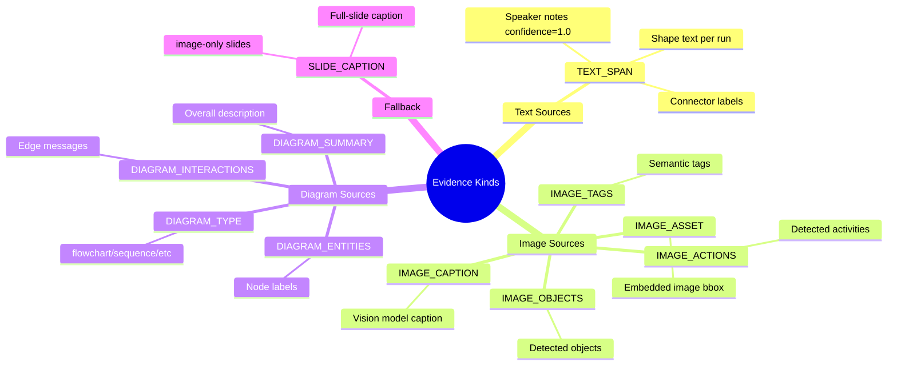
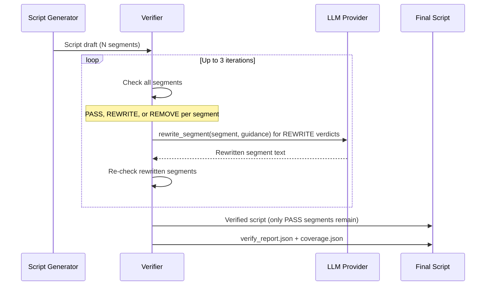
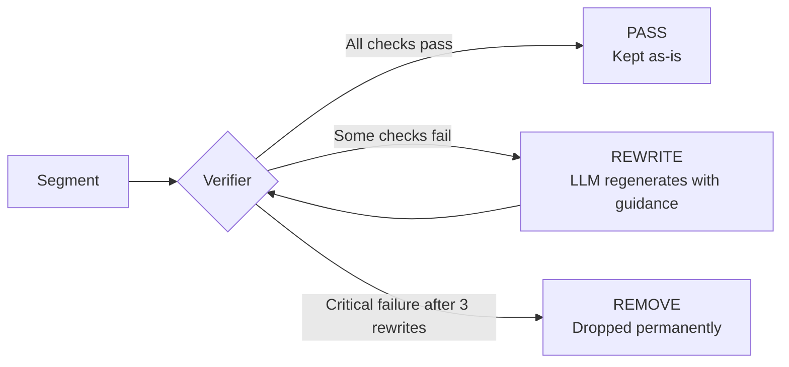

# Evidence System & No-Hallucination

The evidence system is the core innovation in SlideSherlock. It transforms hallucination prevention from a "best-effort prompt" into a **hard technical constraint** enforced before any word of narration reaches the final video.

---

## Why Hallucination Is a Hard Problem

Large language models narrate slide content from text descriptions. When a slide contains a diagram or photograph, the model must describe visual content it cannot directly observe — leading to invented entities, relationships, or captions. Even careful prompting cannot prevent this systematically.

SlideSherlock takes a different approach: **if a narration claim cannot be traced to a specific, machine-readable evidence item, it is blocked from the output**.

---

## Evidence Index

### Structure

The evidence index is built once per job, before script generation begins. Every extractable fact becomes an `EvidenceItem`:

```json
{
  "evidence_id": "e3b0c44298fc1c149afb4c8996fb92427ae41e4649b934ca495991b7852b855",
  "job_id": "550e8400-...",
  "slide_index": 2,
  "kind": "DIAGRAM_ENTITIES",
  "content": "User Service, Order Service, Payment Gateway",
  "confidence": 0.92,
  "language": "en-US",
  "source_refs": [
    {
      "ref_type": "IMAGE",
      "bbox_x": 914400.0,
      "bbox_y": 685800.0,
      "bbox_w": 3657600.0,
      "bbox_h": 2743200.0,
      "url": "images/slide_002/img_00.png"
    }
  ]
}
```

### Evidence ID Stability

Evidence IDs are **deterministic hashes**, not random UUIDs:

```python
evidence_id = SHA256(f"{job_id}|{slide_index}|{kind}|{offset_key}")
```

The `offset_key` encodes the exact source location:
- For speaker notes: `"notes"`
- For shape text: `"{ppt_shape_id}_{run_index}"`
- For connector text: `"{ppt_connector_id}_{para_index}"`

**Same presentation → same evidence IDs across reruns.** This makes the evidence index auditable: you can always trace a narration claim back to a precise location in the source file.

### Evidence Kinds



### Image Evidence Special Rule

Any narration segment that references visual content — indicated by tokens like *"shows"*, *"diagram"*, *"image"*, *"illustrates"*, *"depicts"* — **must** cite at least one item from the image evidence kinds:

```python
IMAGE_EVIDENCE_KINDS = {
    "IMAGE_ASSET",
    "IMAGE_CAPTION", "IMAGE_OBJECTS", "IMAGE_ACTIONS", "IMAGE_TAGS",
    "DIAGRAM_TYPE", "DIAGRAM_ENTITIES", "DIAGRAM_INTERACTIONS", "DIAGRAM_SUMMARY",
    "SLIDE_CAPTION",
}
```

If no such evidence exists for that slide, the claim is either rewritten (to avoid visual references) or removed.

---

## Verifier Loop

### Overview

After script generation produces a draft, the verifier evaluates every segment against the evidence index:



### Verification Checks

Each segment is evaluated against **all** of the following checks:

| Check | Reason Code | Recovery |
|---|---|---|
| Segment has at least one `evidence_id` | `NO_EVIDENCE_IDS` | Assign fallback evidence from slide |
| All cited `evidence_ids` exist in the index | `EVIDENCE_NOT_FOUND` | `REWRITE` to remove invalid refs |
| All cited `entity_ids` exist in `G_unified` | `ENTITY_NOT_IN_GRAPH` | `REWRITE` to remove invalid entities |
| Claim tokens overlap with cited evidence content | `UNSUPPORTED_BY_EVIDENCE` | `REWRITE` |
| Image claims cite image evidence | `IMAGE_UNGROUNDED` | `REWRITE` or `REMOVE` |
| Object/action tokens appear in evidence | `OBJECT_ACTION_UNSUPPORTED` | `REWRITE` |
| Diagram claims overlap with diagram evidence | `DIAGRAM_UNSUPPORTED` | `REWRITE` |
| Low-confidence evidence uses hedging words | `NEEDS_HEDGING` | `REWRITE` to add *"appears to show"*, *"likely"*, etc. |
| Claimed graph relations exist in unified graph | `GRAPH_CONTRADICTION` | `REWRITE` |

### Verdicts



- **PASS** — The segment is grounded and enters the final script unchanged
- **REWRITE** — The LLM is given the failed reason codes and regenerates the segment; re-evaluated up to `max_iters` (default 3) times
- **REMOVE** — After exhausting rewrites, or when grounding is structurally impossible (e.g. the slide has no evidence at all for that claim), the segment is dropped

### Coverage Report

After the loop completes, `coverage.json` is written:

```json
{
  "total_segments": 28,
  "pass": 26,
  "rewrite": 1,
  "remove": 1,
  "pass_rate": 0.929,
  "evidence_coverage": {
    "TEXT_SPAN": 18,
    "IMAGE_CAPTION": 5,
    "DIAGRAM_ENTITIES": 3
  }
}
```

---

## Hedging Policy

For image evidence with `confidence < 0.65` (configurable via `VISION_MIN_CONFIDENCE`), the verifier requires hedging language. Segments must use phrases such as:

- *"appears to show"*
- *"likely illustrates"*
- *"seems to depict"*
- *"possibly represents"*

If absent, the segment receives `REASON_NEEDS_HEDGING` and is rewritten to include appropriate hedging before delivery to the TTS stage.

The `used_hedging: true` flag on a segment signals downstream that the narration has an epistemic qualifier — useful for UI display or quality-assurance review.

---

## Confidence Levels by Source

| Evidence Kind | Typical Confidence | Rationale |
|---|---|---|
| Speaker notes | 1.0 | Author-written; authoritative |
| Shape text | 1.0 | Native PPT data |
| Connector text | 1.0 | Native PPT data |
| Vision caption (GPT-4o) | 0.85–0.95 | Strong but model-generated |
| Vision objects | 0.75–0.90 | Depends on model clarity |
| Diagram entities | 0.80–0.92 | Entity extraction accuracy |
| Diagram interactions | 0.70–0.88 | Relationship extraction |
| Slide caption (fallback) | 0.55–0.70 | Full-slide inference; less specific |
| Vision (ambiguous image) | 0.40–0.60 | Triggers hedging |
