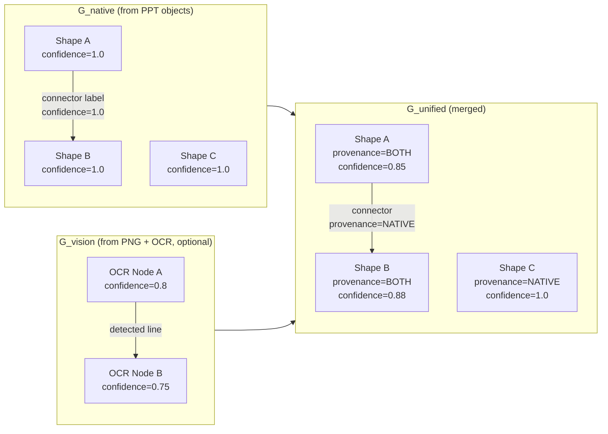
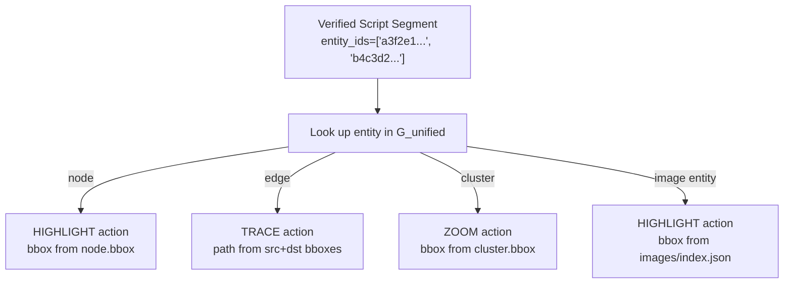

# Graph System

SlideSherlock builds a structural model of each slide as a graph — not just as flat text. This graph drives both the visual guidance overlays (HIGHLIGHT, TRACE, ZOOM) and the verifier's structural consistency checks.

---

## Three Layers



---

## G_native — Native Graph

**Module:** `packages/core/native_graph.py`

Built entirely from the PPT object model — no image processing required. This layer is always present, regardless of whether vision features are enabled.

### Nodes

Each text-bearing shape becomes a node:

```json
{
  "node_id": "a3f2e1...",
  "label_text": "Payment Gateway",
  "bbox": {"x": 2743200, "y": 1371600, "w": 2057400, "h": 685800},
  "ppt_shape_id": "sp_14",
  "z_order": 3,
  "text_runs": ["Payment Gateway"],
  "confidence": 1.0,
  "needs_review": false,
  "provenance": "NATIVE"
}
```

`node_id = SHA256(slide_index | ppt_shape_id)` — stable across reruns.

### Edges

Each connector shape becomes an edge. Endpoint resolution uses a three-tier strategy:

1. **Bbox containment** — if exactly one shape's bounding box contains the connector's begin/end point, that shape is the endpoint (confidence 1.0)
2. **Nearest centre** — if no single shape contains the point, the closest shape by Euclidean distance is used (confidence 0.7)
3. **Tie** — if two shapes are equidistant, both are flagged as candidates and `needs_review = true` (confidence 0.4)

```json
{
  "edge_id": "b4c3d2...",
  "src_node_id": "a3f2e1...",
  "dst_node_id": "c5d4e3...",
  "label_text": "POST /charge",
  "style": "straight",
  "confidence": 1.0,
  "needs_review": false,
  "provenance": "NATIVE"
}
```

### Clusters

Group shapes become clusters holding member node IDs:

```json
{
  "cluster_id": "f6e5d4...",
  "label_text": "Backend Services",
  "member_node_ids": ["a3f2e1...", "c5d4e3..."],
  "bbox": {"x": 914400, "y": 685800, "w": 5486400, "h": 3657600},
  "confidence": 1.0,
  "provenance": "NATIVE"
}
```

---

## G_vision — Vision Graph (Optional)

**Module:** `packages/core/vision_graph.py`

Built from the rendered 150 DPI PNG using Tesseract OCR and line detection. This layer supplements the native graph for slides where shapes lack text (e.g. diagram images inserted as pictures).

Active when `VISION_ENABLED=1` and Tesseract is installed.

| G_vision component | Source | Confidence range |
|---|---|---|
| Nodes | OCR text bounding boxes | 0.6–0.85 |
| Edges | Detected lines/arrows | 0.5–0.75 |

---

## G_unified — Unified Graph

**Module:** `packages/core/merge_engine.py`

Merges `G_native` and `G_vision` per slide. Nodes from both graphs are matched by **bounding box overlap** (IoU threshold). Matched nodes are merged; unmatched nodes from either graph are included with their original provenance.

### Provenance Values

| Value | Meaning |
|---|---|
| `NATIVE` | Present only in G_native |
| `VISION` | Present only in G_vision |
| `BOTH` | Matched across both graphs |

### Confidence Propagation

For merged nodes: `confidence_unified = min(confidence_native, confidence_vision)`

This conservative approach ensures that if either source is uncertain, the merged entity reflects that uncertainty.

### `needs_review` Flag

Set to `true` if either source marked the entity for review (e.g. ambiguous connector endpoints). The flag propagates to timeline actions — HIGHLIGHT/TRACE on a `needs_review` entity results in a lower-confidence action that the composer may render with reduced visual prominence.

---

## Entity Links (PostgreSQL)

For each node, edge, and cluster, the native graph builder writes `EntityLink` rows to PostgreSQL with two roles:

| Role | Content |
|---|---|
| `LABEL` | Text-derived name (e.g. "Payment Gateway") |
| `GEOMETRY` | Bounding box in EMU (x, y, w, h) |

Entity links connect graph entities back to evidence items, enabling the script generator to find evidence for a given entity ID and the verifier to check entity-evidence consistency.

---

## How the Graph Drives Visual Actions

The timeline builder reads `G_unified` to generate visual overlay actions:



Coordinates are converted from EMU to pixels based on the rendered slide dimensions (from the 150 DPI PNG). This means overlays are always pixel-accurate to the original shape positions — even when the aspect ratio changes between the PPTX canvas and the output video resolution.
