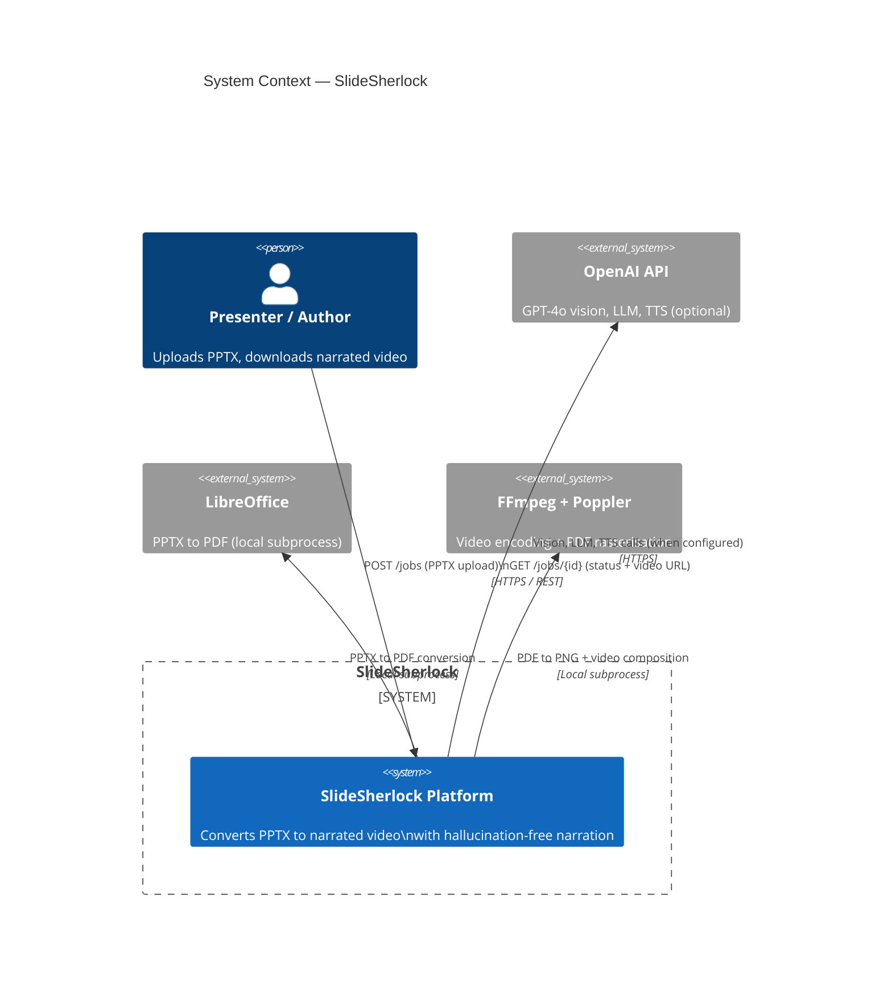
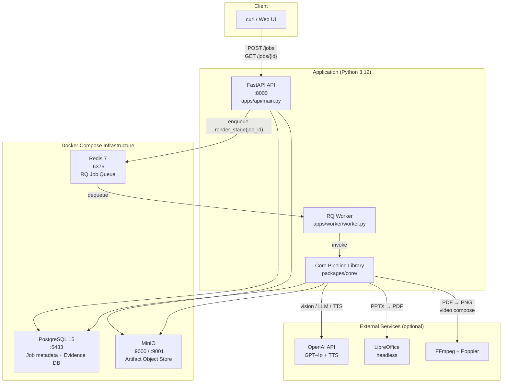
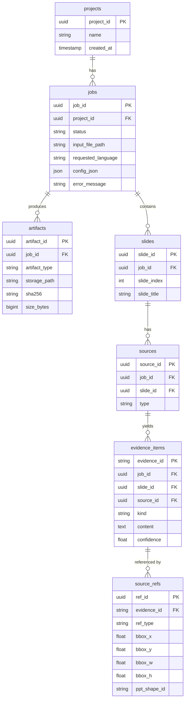

# Architecture Overview

SlideSherlock is built around a single design principle: **artifact-first, evidence-grounded processing**. Every stage in the pipeline writes its outputs to an object store (MinIO) with stable, deterministic paths, and every narration claim must be traceable to an entry in the evidence index stored in PostgreSQL.

---

## System Context



---

## Container Architecture



---

## Database Schema (Key Tables)



---

## MinIO Artifact Structure

All pipeline outputs are stored under a single bucket (`slidesherlock`) with the following path convention:

```
jobs/{job_id}/
├── input.pptx                         ← uploaded presentation
├── ppt/
│   └── slide_N.json                   ← parsed slide data (shapes, connectors, notes)
├── images/
│   ├── index.json                     ← image inventory with stable image IDs
│   └── slide_N/img_K.png              ← extracted embedded images
├── vision/
│   ├── image_kinds.json               ← PHOTO / DIAGRAM / CHART classification
│   ├── photo_results.json             ← vision captions for photos
│   └── diagram_N.json                 ← diagram analysis per image
├── evidence/
│   └── index.json                     ← complete evidence index
├── graphs/
│   ├── native/slide_N.json            ← G_native (from PPT shapes)
│   ├── vision/slide_N.json            ← G_vision (from OCR, optional)
│   └── unified/slide_N.json           ← G_unified (merged)
├── render/
│   ├── deck.pdf                       ← LibreOffice output
│   └── slides/slide_N.png             ← 150 DPI PNG frames
├── script/{variant}/
│   ├── explain_plan.json              ← narration plan
│   ├── script.json                    ← verified script
│   ├── script_translated.json         ← translated script (l2 variant)
│   └── narration_per_slide.json       ← per-slide narration text
├── audio/{variant}/
│   └── slide_N.wav                    ← synthesised speech per slide
├── timing/{variant}/
│   ├── alignment.json
│   └── slide_N_duration.json
├── timeline/{variant}/
│   └── timeline.json                  ← HIGHLIGHT / TRACE / ZOOM actions
├── overlays/{variant}/
│   └── slide_N_overlay.mp4            ← annotated slide video
├── output/{variant}/
│   ├── final.mp4                      ← final narrated video
│   └── final.srt                      ← subtitles
├── verify_report.json                 ← verifier verdicts
├── coverage.json                      ← evidence coverage statistics
├── metrics.json
└── summary.json
```

`{variant}` is `en` by default, or any BCP-47 language code when multi-language output is requested.

---

## Orchestration Model

The entire pipeline is **a single Python function**: `render_stage(job_id)` in `apps/api/worker.py`. It runs sequentially, writing each stage's outputs to MinIO before proceeding to the next. This design means:

- **Reproducibility**: Re-running from any point is safe because all intermediate results are persisted with stable paths
- **Debuggability**: You can inspect any intermediate artifact in MinIO without re-running the full pipeline
- **Idempotency**: Evidence IDs and graph node IDs are deterministic hashes — re-running on the same input produces the same IDs

The worker process is a standard [RQ](https://python-rq.org/) worker — it pulls `job_id` values off a Redis queue and executes `render_stage`.
