# Pipeline Stages

The pipeline is implemented as a set of **10 composable Stage objects** that conform to a single `Stage` protocol:

```python
class Stage(Protocol):
    name: str
    def run(self, ctx: PipelineContext) -> StageResult: ...
```

The orchestrator (`packages/core/pipeline.py` → `run_pipeline(job_id)`) executes the stages in order. `apps/api/worker.py` is a thin three-line wrapper that simply calls `run_pipeline()`. Adding a new stage means writing a new file in `packages/core/stages/` and registering it in the orchestrator — no other code changes are required (Open/Closed Principle).

There are **4 shared stages** (run once per job, regardless of how many language variants are produced) and **6 per-variant stages** (run once for each output language):

| # | Stage | Type | Module |
|---|---|---|---|
| 1 | **Ingest** | Shared | `stages/ingest.py` |
| 2 | **Evidence** | Shared | `stages/evidence.py` |
| 3 | **Render** | Shared | `stages/render.py` |
| 4 | **Graph** | Shared | `stages/graph.py` |
| 5 | **Script** | Per-variant | `stages/script.py` |
| 6 | **Verify** | Per-variant | `stages/verify.py` |
| 7 | **Translate** | Per-variant (l2 only) | `stages/translate.py` |
| 8 | **Narrate** *(NEW)* | Per-variant (optional) | `stages/narrate.py` |
| 9 | **Audio** | Per-variant | `stages/audio.py` |
| 10 | **Video** | Per-variant | `stages/video.py` |

Each stage returns a `StageResult` containing a `metrics` dict (durations, counts, pass rates, token usage). At the end of the run, all metrics are aggregated and written to `jobs/{job_id}/metrics.json` for paper-ready aggregation across corpora.

---

## Full Pipeline Flow

```mermaid
flowchart TD
    A([PPTX in MinIO]) --> B[Parse PPTX\nppt_parser.py]
    B --> C[Extract Images\nimage_extract.py]
    C --> D[Classify Images\nimage_classifier.py]
    D --> E[Build Evidence Index\nevidence_index.py]
    E --> F{Vision\nEnabled?}
    F -- Yes --> G[Photo Understanding\nphoto_understand.py]
    F -- Yes --> H[Diagram Understanding\ndiagram_understand.py]
    F -- No --> I
    G --> I[Build Native Graph\nnative_graph.py]
    H --> I
    I --> J{Vision\nEnabled?}
    J -- Yes --> K[Build Vision Graph\nvision_graph.py + OCR]
    J -- No --> L
    K --> L[Merge Graphs\nmerge_engine.py]
    L --> M[Slide Caption Fallback\nslide_caption_fallback.py]
    M --> N[LibreOffice: PPTX → PDF]
    N --> O[Poppler: PDF → PNG Slides]
    O --> P[Cross-link Image Evidence\nimage_understand.py]
    P --> Q

    subgraph VARIANT["Per Output Variant (en, l2, ...)"]
        Q[Build Explain Plan\nexplain_plan.py]
        Q --> R[Generate Script Draft\nscript_generator.py]
        R --> S[Verifier Rewrite Loop\nverifier.py]
        S --> T{l2 variant?}
        T -- Yes --> U[Translate Script + Notes\ntranslator_provider_llm.py]
        T -- No --> NA
        U --> NA{AI Narration\nEnabled?}
        NA -- Yes --> NB[NarrateStage\nGPT-4o-mini rewrite\nstages/narrate.py]
        NA -- No --> V
        NB --> V[Prepare Audio\naudio_prepare.py + tts_provider.py]
        V --> W[Build Alignment\nalignment.py]
        W --> X[Build Timeline\ntimeline_builder.py]
        X --> Y[Render Overlays\noverlay_renderer.py]
        Y --> Z[Compose Video\ncomposer.py]
    end

    Z --> AA([final.mp4 + final.srt\nin MinIO])
```



---

## Stage Reference

### Stage 1 — Parse PPTX

**Module:** `packages/core/ppt_parser.py`
**Output:** `ppt/slide_N.json` (one per slide)

Extracts the complete shape tree from each slide using `python-pptx`:

| Extracted element | Details |
|---|---|
| `shapes` | Each shape: `ppt_shape_id`, bbox (EMU), `type`, `text_runs`, `z_order` |
| `connectors` | Each connector: endpoints `{x,y}` begin/end, `style`, label, `z_order` |
| `groups` | Nested child lists; recursively flattened for evidence and graph building |
| `notes` | Full speaker notes text |
| `slide_text` | Concatenated text from all runs (used for slide-type classification) |

All coordinates are in **EMU (English Metric Units)**: 914,400 EMU = 1 inch.

---

### Stage 2 — Extract Embedded Images

**Module:** `packages/core/image_extract.py`
**Output:** `images/slide_N/img_K.{png,jpg}`, `images/index.json`

Iterates `PicturePlaceholder` and picture shapes (including inside groups), extracts image bytes, and assigns a stable `image_id`:

```python
image_id = SHA256(job_id | slide_index | "IMAGE_ASSET" | ppt_shape_id)
```

The index records: `image_id`, `ppt_shape_id`, `slide_index`, `bbox` (EMU), `normalized_bbox` (0.0–1.0), `z_index`, MIME type, SHA-256, file size.

---

### Stage 3 — Classify Images

**Module:** `packages/core/image_classifier.py`
**Output:** `vision/image_kinds.json`

Assigns each image one of: `PHOTO`, `DIAGRAM`, `CHART`, `SCREENSHOT`, `ICON`.
Classification can be overridden per slide using `force_kind_by_slide` in the job's `config_json`.

---

### Stage 4 — Build Evidence Index

**Module:** `packages/core/evidence_index.py`
**Output:** `evidence/index.json` + PostgreSQL rows

This is the **foundation of the no-hallucination system**. See [Evidence System](evidence-system) for a deep dive.

---

### Stage 5 — Vision Understanding (Optional)

**Modules:** `photo_understand.py`, `diagram_understand.py`, `slide_caption_fallback.py`
**Output:** `vision/photo_results.json`, `vision/diagram_N.json`; appended to `evidence/index.json`

| Sub-stage | Condition | New Evidence Kinds |
|---|---|---|
| Photo understanding | `PHOTO`-classified images | `IMAGE_CAPTION`, `IMAGE_OBJECTS`, `IMAGE_ACTIONS`, `IMAGE_TAGS` |
| Diagram understanding | `DIAGRAM`-classified images | `DIAGRAM_TYPE`, `DIAGRAM_ENTITIES`, `DIAGRAM_INTERACTIONS`, `DIAGRAM_SUMMARY` |
| Slide caption fallback | Image-only slides, no text/notes | `SLIDE_CAPTION` |

---

### Stage 6 — Build Native Graph

**Module:** `packages/core/native_graph.py`
**Output:** `graphs/native/slide_N.json` + PostgreSQL `EntityLink` rows

Builds `G_native` from PPT shape objects:

- **Nodes** — one per shape with text; `node_id = SHA256(slide_index | ppt_shape_id)`
- **Edges** — one per connector; endpoints resolved by bbox containment
- **Clusters** — one per group; holds member `node_ids`

Endpoint resolution confidence:
| Situation | Confidence |
|---|---|
| Single shape contains endpoint | 1.0 |
| Nearest-centre match | 0.7 |
| Tie (equidistant) | 0.4 — `needs_review = true` |

---

### Stage 7 — Build Vision Graph (Optional)

**Module:** `packages/core/vision_graph.py`
**Output:** `graphs/vision/slide_N.json`, `ocr/slide_N.json`

When `VISION_ENABLED=1`, runs Tesseract OCR on the rendered PNG slide:
- Text bounding boxes → graph nodes
- Detected lines/arrows → graph edges

---

### Stage 8 — Merge Graphs

**Module:** `packages/core/merge_engine.py`
**Output:** `graphs/unified/slide_N.json`

Merges `G_native` and `G_vision` into `G_unified`. Nodes are matched by bbox overlap. Each entity in `G_unified` carries:

```json
{
  "node_id": "abc123...",
  "label_text": "User Service",
  "bbox": {"x": 1234567, "y": 900000, "w": 800000, "h": 500000},
  "provenance": "BOTH",
  "confidence": 0.85,
  "needs_review": false
}
```

---

### Stage 9 — Slide Rendering

**Tools:** LibreOffice (headless), Poppler (`pdftoppm`)
**Output:** `render/deck.pdf`, `render/slides/slide_N.png`

```bash
# Internally executed:
soffice --headless --convert-to pdf input.pptx
pdftoppm -r 150 deck.pdf slide  # → slide_001.png, slide_002.png, ...
```

Each PNG artifact records width, height, size_bytes, and SHA-256 hash.

---

### Stage 10 — Script Generation (per variant)

**Modules:** `explain_plan.py`, `script_generator.py`
**Output:** `script/{variant}/explain_plan.json`, `script/{variant}/script.json` (draft)

**Explain plan** sections each slide into narration sections, assigning `entity_ids` and `evidence_ids` from the unified graph and evidence index.

**Script generation** applies a safe phrasing policy:

| Policy | Condition | Behaviour |
|---|---|---|
| `notes` | Speaker notes available | Narrate from notes; cite note evidence (confidence 1.0) |
| `image_evidence` | Image/diagram evidence available (no notes) | Narrate from vision evidence; add hedging if confidence < 0.65 |
| `generic` | No evidence beyond shape text | Generic template narration (slide type classification) |

Each segment carries: `claim_id`, `text`, `evidence_ids[]`, `entity_ids[]`, `used_hedging`.

---

### Stage 11 — Verifier + Rewrite Loop

**Module:** `packages/core/verifier.py`
**Output:** `script/{variant}/script.json` (verified), `verify_report.json`, `coverage.json`

See [Evidence System](evidence-system#verifier-loop) for the complete check list and loop logic.

---

### Stage 12 — Translation (l2 variant only)

**Module:** `packages/core/translator_provider_llm.py`
**Output:** `script/{variant}/script_translated.json`, `notes/{variant}/notes_translated.json`

The verified English script and optional speaker notes are translated to the `requested_language` (BCP-47) using the configured LLM provider.

---

### Stage 12.5 — Narrate (Optional, NEW)

**Module:** `packages/core/stages/narrate.py`
**Output:** `script/{variant}/narration_per_slide.json` (rewritten in place)
**Activates when:** `ctx.config["ai_narration"] == True` (set via UI toggle, `--ai-narration` CLI flag, or `config_json.ai_narration`)

The verified, evidence-grounded script is fed into a dedicated **AI Narration Stage** that uses **GPT-4o-mini** (configurable) to rewrite each per-slide narration block into a more natural-sounding presenter delivery, while preserving every claim that the verifier already approved.

**Two-pass design preserves the no-hallucination guarantee:**

```
Pass 1 (StubLLMProvider): template → grounded script → verifier (REWRITE/REMOVE loop)
Pass 2 (NarrateStage):    verified script → GPT-4o-mini natural rewrite → audio
```

Because Pass 1 already enforced grounding, Pass 2 only operates on **text that the verifier accepted**. The model is prompted to keep the same factual content and only adjust phrasing, cadence, and presenter tone. No new entities, claims, or evidence references can be introduced.

**Implementation notes:**

| Concern | Choice |
|---|---|
| HTTP client | Plain `requests` (fork-safe) — **not** the `openai` SDK, which uses `httpx` and deadlocks inside RQ forked workers |
| Concurrency | `concurrent.futures.ThreadPoolExecutor` with bounded parallelism (default **5** concurrent requests) |
| Retry / backoff | Exponential backoff on HTTP 429 / 5xx |
| Failure mode | Per-slide failures fall back to the original verified narration — never blocks the pipeline |

**Configuration:**

| Variable | Default | Description |
|---|---|---|
| `NARRATE_MODEL` | `gpt-4o-mini` | OpenAI model used for the rewrite. `gpt-4o` for higher quality at ~10× cost. |
| `NARRATE_PARALLEL` | `5` | Maximum concurrent OpenAI calls per job |
| `OPENAI_API_KEY` | _(required when enabled)_ | API key |

**Cost (with `gpt-4o-mini`)**: roughly **$0.001 per slide**. A 30-slide deck costs about $0.03.

See the [AI Narration guide](../guides/ai-narration) for end-to-end usage, privacy considerations, and local LLM alternatives.

---

### Stage 13 — Audio Preparation

**Modules:** `audio_prepare.py`, `tts_provider.py`, `narration_blueprint.py`
**Output:** `audio/{variant}/slide_N.wav`, `script/{variant}/narration_per_slide.json`, `timing/{variant}/slide_N_duration.json`

Narration source priority:
1. User-supplied audio (`input/audio/slide_N.wav`) — passthrough with loudness normalisation
2. Translation override (l2 variant)
3. `build_narration_per_slide()` using evidence + narration blueprint
4. Generic slide-type template

TTS output is processed: loudness normalised to the configured LUFS target and resampled to 48 kHz.

---

### Stage 14 — Alignment

**Module:** `packages/core/alignment.py`
**Output:** `timing/{variant}/alignment.json`

Maps each `claim_id` to absolute timestamps based on per-slide audio durations.

---

### Stage 15 — Timeline Builder

**Module:** `packages/core/timeline_builder.py`
**Output:** `timeline/{variant}/timeline.json`

Generates one `TimelineAction` per script segment:

| Entity Type | Action |
|---|---|
| Graph node | `HIGHLIGHT` |
| Graph edge | `TRACE` |
| Graph cluster | `ZOOM` |
| IMAGE_* evidence | `HIGHLIGHT` or `ZOOM` on image bbox |

Each action carries: `action_type`, `entity_ids[]`, `bbox`, `path` (for TRACE), `t_start`, `t_end`, `claim_id`, `evidence_ids[]`.

---

### Stage 16 — Overlay Rendering

**Module:** `packages/core/overlay_renderer.py`
**Output:** `overlays/{variant}/slide_N_overlay.mp4`

For each slide PNG, uses FFmpeg filter graphs to render:
- `HIGHLIGHT` → `drawbox` with animated opacity
- `TRACE` → `drawline` following connector path
- `ZOOM` → `scale`/`crop` filter
- On-screen notes → Pillow text rendering burned into the video

---

### Stage 17 — Video Composition

**Module:** `packages/core/composer.py`
**Output:** `output/{variant}/final.mp4`, `output/{variant}/final.srt`

Final FFmpeg composition:
1. Optional intro title card (rendered with Pillow, looped to `intro_duration`)
2. Per-slide overlay MP4s concatenated with configured transition
3. Optional outro title card
4. Per-slide audio channels merged
5. Optional BGM track mixed with narration ducking
6. Optional loudness normalisation (`ffmpeg-normalize`)
7. Optional SRT subtitle burn-in
