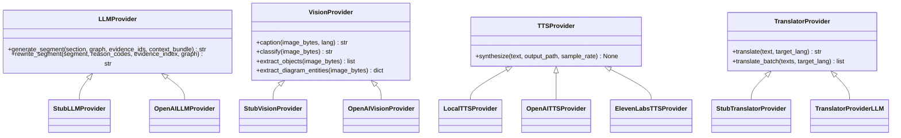

# Provider System

Every external integration in SlideSherlock is behind a **provider interface** with a stub default implementation. The pipeline runs fully end-to-end without any API keys — stubs return deterministic template output so you can develop, test, and demo locally without incurring costs.

---

## Provider Interfaces



---

## LLM Provider

**File:** `packages/core/llm_provider.py`

Used for script segment generation and verifier rewrites.

### StubLLMProvider (default)

Returns deterministic template text derived from:
- Slide type (DIAGRAM_PROCESS, BULLET_LIST, CHART, TITLE_ONLY)
- Graph structure (node/edge counts, labels)
- Available evidence (notes text, image captions)

No API key required. Suitable for development and pipeline testing.

### OpenAILLMProvider

**File:** `packages/core/llm_provider_openai.py`

Activated when `OPENAI_API_KEY` is set and `LLM_PROVIDER=openai` (or `auto` with a key present).

```bash
export OPENAI_API_KEY=sk-...
export LLM_PROVIDER=openai
```

:::important Fork-safe HTTP client
`OpenAILLMProvider` (and the dedicated `NarrateStage`) call the OpenAI REST API using the **`requests` library directly** rather than the official `openai` Python SDK. The SDK's underlying `httpx` client deadlocks inside RQ forked workers on macOS and some Linux configurations. Using `requests` avoids the fork-safety issue entirely.
:::

Uses `gpt-4o` by default for script generation, `gpt-4o-mini` for the narration rewrite. Configurable:

| Variable | Default | Description |
|---|---|---|
| `OPENAI_LLM_MODEL` | `gpt-4o` | Model ID for script generation / verifier rewrite |
| `OPENAI_LLM_TEMPERATURE` | `0.3` | Generation temperature |
| `OPENAI_LLM_TIMEOUT_SECONDS` | `60` | Request timeout |
| `NARRATE_MODEL` | `gpt-4o-mini` | Model ID for the dedicated NarrateStage |
| `NARRATE_PARALLEL` | `5` | Bounded concurrency for parallel narration calls |

### Two-Pass AI Narration

SlideSherlock separates **grounding** from **delivery quality** into two distinct passes that share the same LLM provider abstraction:

```
Pass 1: StubLLMProvider (deterministic, evidence-cited)
        → script_generator
        → verifier (PASS / REWRITE / REMOVE loop)
        → verified script with grounded claims

Pass 2: NarrateStage (GPT-4o-mini, natural delivery)
        → rewrites verified narration in place
        → bounded ThreadPoolExecutor parallelism
        → preserves all claims from Pass 1
```

Pass 1 always uses the **StubLLMProvider** so that the verifier loop is deterministic, fast, and free. Pass 2 is **completely optional** and only triggered when the user enables AI narration on the upload page, in the CLI (`--ai-narration`), or in `config_json.ai_narration`. Because the verifier has already approved the text, Pass 2 cannot introduce hallucinations — it only rephrases.

---

## Vision Provider

**Files:** `packages/core/vision_provider.py`, `packages/core/vision_provider_openai.py`

Used for photo captioning, object detection, and diagram understanding.

### StubVisionProvider (default)

Returns generic captions and empty object/entity lists. Useful when:
- No `OPENAI_API_KEY` is configured
- `VISION_ENABLED=0` (preset: draft)
- Testing pipeline structure without API costs

### OpenAI Vision Provider

Activated when `OPENAI_API_KEY` is set **and** `VISION_PROVIDER=openai`.

```bash
export OPENAI_API_KEY=sk-...
export VISION_PROVIDER=openai
```

| Variable | Default | Description |
|---|---|---|
| `OPENAI_VISION_MODEL` | `gpt-4o-mini` | Vision model ID (was `gpt-4o`; downgraded for cost) |
| `OPENAI_VISION_TEMPERATURE` | `0` | Deterministic outputs |
| `OPENAI_VISION_TIMEOUT_SECONDS` | `60` | Per-request timeout |

The default vision model is now **`gpt-4o-mini`**, which is roughly 15× cheaper than `gpt-4o` while remaining accurate enough for slide-level photo and diagram understanding. Override to `gpt-4o` for benchmark-quality runs.

**Result caching:** Vision results are cached in MinIO at `jobs/{job_id}/cache/vision/` keyed by:

```
SHA256(image_bytes | model | lang | prompt_version)
```

The cache key includes the model and prompt version so that swapping `gpt-4o-mini` ↔ `gpt-4o` or evolving the prompt automatically invalidates stale entries. This avoids re-charging the API for identical images across reruns of the same deck. Disable with `VISION_CACHE_ENABLED=false`.

---

## TTS Provider

**File:** `packages/core/tts_provider.py`

Factory function: `get_tts_provider(provider, voice_id, lang)`

### LocalTTSProvider

Uses the system's native TTS without an internet connection:
- **macOS**: `say` command (high quality, supports many languages)
- **Linux**: `espeak` or `pyttsx3`
- **Windows**: `pyttsx3` SAPI5

```bash
export USE_SYSTEM_TTS=true
```

:::warning macOS fork-safety
On macOS, **`USE_SYSTEM_TTS=true` is required** when running the RQ worker. Without it, `pyttsx3` initialises the AVSpeechSynthesizer in the parent process and then deadlocks when RQ forks to run a job. Setting `USE_SYSTEM_TTS=true` makes the TTS provider shell out to the macOS `say` command instead, which is fork-safe. The Makefile target `make worker` sets this automatically along with `OBJC_DISABLE_INITIALIZE_FORK_SAFETY=YES`.
:::

Multilingual voice selection is automatic based on `lang` (BCP-47):

| Language | macOS Voice |
|---|---|
| `en-US` | Alex / Samantha |
| `hi-IN` | Lekha |
| `es-ES` | Monica |
| `fr-FR` | Thomas |
| `de-DE` | Anna |

### OpenAI TTS Provider

```bash
export OPENAI_API_KEY=sk-...
# TTS provider is selected automatically when key is present
```

| Variable | Default | Options |
|---|---|---|
| `OPENAI_TTS_MODEL` | `tts-1` | `tts-1`, `tts-1-hd` |
| `OPENAI_TTS_VOICE` | `alloy` | `alloy`, `echo`, `fable`, `onyx`, `nova`, `shimmer` |

### ElevenLabs TTS Provider

```bash
export ELEVENLABS_API_KEY=...
export ELEVENLABS_VOICE_ID=...  # from your ElevenLabs account
```

---

## Translator Provider

**Files:** `packages/core/translator_provider.py`, `packages/core/translator_provider_llm.py`

Used for the l2 (second language) variant when `requested_language` is set on the job.

### StubTranslatorProvider (default)

A no-op provider that returns the source text unchanged. The l2 variant will have the same language as `en` — useful for testing the multi-variant pipeline without API calls.

### TranslatorProviderLLM

Uses the configured LLM (same `OPENAI_API_KEY`) to perform a **faithful translation** of the verified script and optional speaker notes. The translator is instructed to preserve every claim, every entity name (when appropriate), and every numeric value exactly. Because the input is the post-verifier script, no new ungrounded claims can be introduced by translation.

```bash
# Job creation with language request
curl -X POST http://localhost:8000/jobs \
  -H "Content-Type: application/json" \
  -d '{"project_id": "...", "name": "Hindi version", "requested_language": "hi-IN"}'
```

The translated script is used for:
1. Audio narration (TTS in target language)
2. On-screen notes (rendered in target language)
3. SRT subtitles (in target language)

---

## Adding a Custom Provider

To add a new provider (e.g. AWS Polly for TTS):

1. Create a new class in the appropriate module inheriting from the base interface
2. Implement all abstract methods
3. Register the provider in the factory function in `tts_provider.py`
4. Add any required environment variables

```python
# packages/core/tts_provider.py

class AwsPollyTTSProvider(TTSProvider):
    def __init__(self, voice_id: str, lang: str):
        self.polly = boto3.client("polly")
        self.voice_id = voice_id

    def synthesize(self, text: str, output_path: str, sample_rate: int = 48000) -> None:
        response = self.polly.synthesize_speech(
            Text=text, OutputFormat="mp3", VoiceId=self.voice_id
        )
        # ... write to output_path
```
