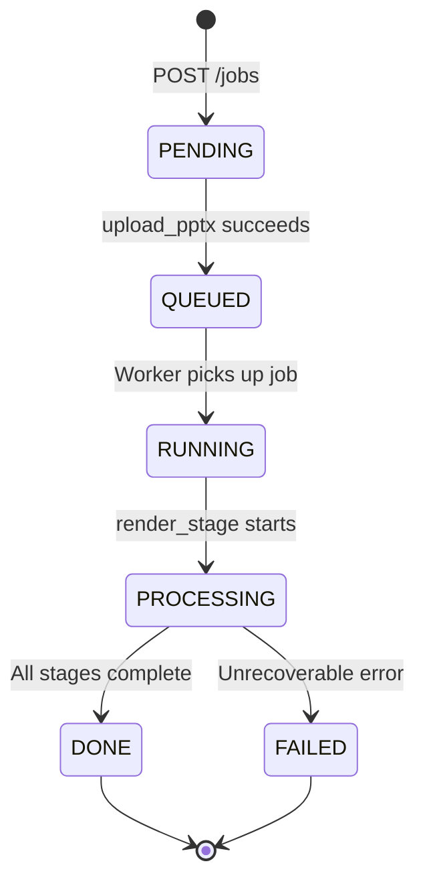

# Submitting and Managing Jobs

This guide covers the complete job lifecycle — from project creation to downloading the final video.

There are four equally supported entry points:

1. **`POST /jobs/quick`** — *recommended*. Creates project + job + uploads PPTX in a single call.
2. **Web UI** — Mission Control upload page at `http://localhost:3000`
3. **CLI** — `slidesherlock run deck.pptx`
4. **Three-step REST flow** — `POST /projects` → `POST /jobs` → `POST /jobs/{id}/upload_pptx`

---

## Quick Submit (recommended)

```bash
# Single call: creates project, job, uploads PPTX, enqueues pipeline
curl -X POST "http://localhost:8000/jobs/quick?ai_narration=true" \
  -F "file=@deck.pptx" \
  -F "preset=pro" \
  -F "name=Architecture overview"
```

### Query parameters

| Parameter | Default | Description |
|---|---|---|
| `ai_narration` | `false` | When `true`, enables the **GPT-4o-mini narration rewrite** (NarrateStage). Requires `OPENAI_API_KEY` on the worker. |
| `requested_language` | _(none)_ | BCP-47 code for an additional language variant (e.g. `hi-IN`) |

### Web UI

The Mission Control upload page (`http://localhost:3000`) wraps `POST /jobs/quick` with a drag-drop file picker, a preset selector (Draft / Standard / Pro), and a **dedicated AI Narration toggle**. Toggling AI Narration sends `ai_narration=true` and the worker activates the NarrateStage.

### CLI

```bash
# Draft run, no AI narration (free, deterministic)
slidesherlock run deck.pptx

# Pro run with AI narration enabled
slidesherlock run deck.pptx --ai-narration --preset pro -o ./results/

# Standard run with a second language variant
slidesherlock run deck.pptx --preset standard --lang hi-IN
```

### Batch / corpus runs

Use `scripts/batch_run.py` to process an entire folder of decks in parallel. This is how the published evaluation tables are generated.

```bash
LLM_PROVIDER=openai python scripts/batch_run.py corpus/ \
  --preset draft --workers 2
```

Each run produces a `run_log.json` next to the `final.mp4`, ready for `pandas.json_normalize()` aggregation.

---

## Job Lifecycle



---

## Step 1 — Create a Project

Projects are containers for jobs. A project groups related video generations together.

```bash
curl -X POST http://localhost:8000/projects \
  -H "Content-Type: application/json" \
  -d '{"name": "Q1 Product Demos", "description": "Product walkthrough videos"}'
```

Response:
```json
{
  "project_id": "a1b2c3d4-...",
  "name": "Q1 Product Demos",
  "created_at": "2024-01-15T10:00:00Z"
}
```

---

## Step 2 — Create a Job

```bash
curl -X POST http://localhost:8000/jobs \
  -H "Content-Type: application/json" \
  -d '{
    "project_id": "a1b2c3d4-...",
    "name": "Architecture Overview Video",
    "requested_language": "en-US"
  }'
```

### Parameters

| Field | Type | Required | Description |
|---|---|---|---|
| `project_id` | UUID | ✓ | Parent project |
| `name` | string | ✓ | Human-readable job name |
| `requested_language` | BCP-47 string | ✗ | Second language for l2 variant (e.g. `hi-IN`, `es-ES`) |
| `config_json` | object | ✗ | Per-job configuration overrides (see below) |

### config_json Options

```json
{
  "preset": "pro",
  "vision": {
    "enabled": true,
    "force_kind_by_slide": {
      "3": "DIAGRAM",
      "5": "PHOTO"
    },
    "min_confidence_for_specific_claims": 0.70
  }
}
```

Response:
```json
{
  "job_id": "550e8400-e29b-41d4-a716-446655440000",
  "project_id": "a1b2c3d4-...",
  "status": "PENDING",
  "created_at": "2024-01-15T10:01:00Z"
}
```

---

## Step 3 — Upload the PPTX

```bash
curl -X POST "http://localhost:8000/jobs/550e8400-.../upload_pptx" \
  -F "file=@/path/to/presentation.pptx"
```

On success, the job transitions to `QUEUED` and the worker is immediately notified via Redis.

Response:
```json
{
  "job_id": "550e8400-...",
  "status": "QUEUED",
  "message": "File uploaded. Job queued for processing."
}
```

---

## Step 4 — Check Status

```bash
curl http://localhost:8000/jobs/550e8400-...
```

Response while processing:
```json
{
  "job_id": "550e8400-...",
  "status": "PROCESSING",
  "stage": "AUDIO",
  "created_at": "2024-01-15T10:01:00Z",
  "updated_at": "2024-01-15T10:03:22Z"
}
```

Response on completion:
```json
{
  "job_id": "550e8400-...",
  "status": "DONE",
  "output_variants": [
    {
      "variant_id": "en",
      "language": "en-US",
      "final_video_url": "/jobs/550e8400-.../artifacts/final_video?variant=en",
      "srt_url": "/jobs/550e8400-.../artifacts/subtitles?variant=en"
    }
  ],
  "created_at": "2024-01-15T10:01:00Z",
  "updated_at": "2024-01-15T10:04:48Z",
  "duration_seconds": 107.3
}
```

---

## Step 5 — Retrieve Artifacts

```bash
# Final video (en variant)
curl "http://localhost:8000/jobs/550e8400-.../artifacts/final_video" \
  -o final_en.mp4

# Final video (l2 variant — requires requested_language on job creation)
curl "http://localhost:8000/jobs/550e8400-.../artifacts/final_video?variant=l2" \
  -o final_hi.mp4

# SRT subtitles
curl "http://localhost:8000/jobs/550e8400-.../artifacts/subtitles" \
  -o final.srt

# Verified script (JSON)
curl "http://localhost:8000/jobs/550e8400-.../artifacts/script" \
  -o script.json

# Verifier coverage report
curl "http://localhost:8000/jobs/550e8400-.../artifacts/verify_report" \
  -o verify_report.json

# Full evidence index
curl "http://localhost:8000/jobs/550e8400-.../artifacts/evidence" \
  -o evidence.json

# List all artifacts
curl "http://localhost:8000/jobs/550e8400-.../artifacts"
```

---

## Multi-Language Jobs

To generate videos in both English and a second language in a single pipeline run:

```bash
# Create job with requested_language
curl -X POST http://localhost:8000/jobs \
  -H "Content-Type: application/json" \
  -d '{
    "project_id": "...",
    "name": "Hindi product video",
    "requested_language": "hi-IN"
  }'
```

The worker generates two variants:
- `en` — English narration (always)
- `l2` — Hindi narration (only when `requested_language` is set)

Evidence, graphs, and rendered slides are generated once and shared between variants. Only the script, translation, audio, overlays, and final composition run twice.

---

## Listing Jobs

```bash
# All jobs in a project
curl "http://localhost:8000/projects/a1b2c3d4-.../jobs"

# A specific job
curl "http://localhost:8000/jobs/550e8400-..."
```

---

## Using the Demo Script

For a single-command end-to-end test using `sample_connectors.pptx`:

```bash
make demo
```

Output is written to `output/demo/final.mp4` on the host filesystem and also uploaded to MinIO.

---

## Shell Script Example

Complete automation script:

```bash
#!/usr/bin/env bash
set -euo pipefail

API=http://localhost:8000
PPTX="$1"  # Pass PPTX path as first argument

# Create project
PROJECT_ID=$(curl -sf -X POST $API/projects \
  -H "Content-Type: application/json" \
  -d '{"name":"Automated Job"}' | python3 -c "import sys,json;print(json.load(sys.stdin)['project_id'])")

# Create job
JOB_ID=$(curl -sf -X POST $API/jobs \
  -H "Content-Type: application/json" \
  -d "{\"project_id\":\"$PROJECT_ID\",\"name\":\"$(basename $PPTX)\"}" \
  | python3 -c "import sys,json;print(json.load(sys.stdin)['job_id'])")

echo "Job ID: $JOB_ID"

# Upload PPTX
curl -sf -X POST "$API/jobs/$JOB_ID/upload_pptx" -F "file=@$PPTX" > /dev/null

# Poll until done
while true; do
  STATUS=$(curl -sf "$API/jobs/$JOB_ID" | python3 -c "import sys,json;print(json.load(sys.stdin)['status'])")
  echo "[$(date +%T)] Status: $STATUS"
  [[ "$STATUS" == "DONE" ]] && break
  [[ "$STATUS" == "FAILED" ]] && echo "Job failed" && exit 1
  sleep 5
done

# Download video
curl -sf "$API/jobs/$JOB_ID/artifacts/final_video" -o "$(basename $PPTX .pptx).mp4"
echo "Video saved: $(basename $PPTX .pptx).mp4"
```

Usage:
```bash
chmod +x ./submit_job.sh
./submit_job.sh /path/to/slides.pptx
```
