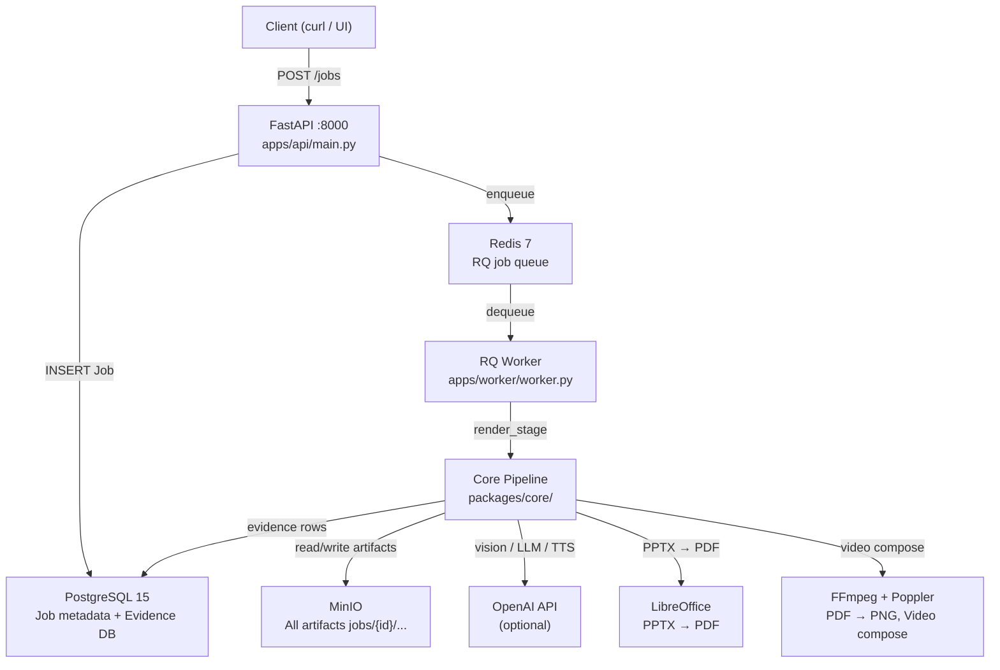

# SlideSherlock

**SlideSherlock converts a PowerPoint presentation (.pptx) into a fully narrated explainer video** — complete with visual guidance overlays (highlight, trace, zoom), synthesised speech, subtitles, and transitions — while enforcing that every word of narration is grounded in the actual content of the slides.

[](https://github.com/sachinkg12/SlideSherlock/blob/main/LICENSE)
[](https://github.com/sachinkg12/SlideSherlock/actions)
[](https://doi.org/10.5281/zenodo.19413324)

**Production-ready and open source.** SlideSherlock ships with **152 automated tests**, a 4-job CI/CD pipeline (test + lint + frontend + Docker), Black + flake8 enforcement, an Apache 2.0 license, and a citable Zenodo DOI. The full stack starts with `docker compose up`.

**Optional AI Narration.** When `OPENAI_API_KEY` is set, a dedicated `NarrateStage` rewrites the verifier-approved script with **GPT-4o-mini** for natural presenter delivery. The two-pass design (grounded template → natural rewrite) preserves the no-hallucination guarantee — see the [AI Narration guide](guides/ai-narration).

**Mission Control web UI.** A React 18 + Tailwind front-end at `apps/web/` provides a Mission Control dashboard with a horizontal pipeline track, focus panel for the active stage, live evidence-trail feed, dark/light theme, and a colour-blind-safe palette (blue/orange, not red/green). Submit decks, monitor verifier decisions in real time, and play back the result with a custom HTML5 player that uses HTTP Range requests for instant seeking.

**Live demo** *(coming soon)*: a read-only, pre-loaded instance is being deployed to a GCP Compute Engine `e2-medium` VM so reviewers can explore the pipeline without uploading their own data.

---

## The Problem

When large language models narrate slide decks they routinely *hallucinate*: they invent entities, relationships, and descriptions that are not present in the source material. This is especially acute for slides containing diagrams, flowcharts, or photographs, where the model must reason about visual structure it has never directly observed.

Existing tools either:
- Generate narration without any grounding check, or
- Ask the model to "stay on topic" through prompt engineering alone — an approach that provides no systematic guarantee.

---

## What SlideSherlock Does Differently

SlideSherlock introduces a **three-layer no-hallucination architecture** that makes grounding a hard technical constraint, not a best-effort prompt:

### 1 — Evidence Index

Before a single word of narration is generated, every extractable fact in the PPTX is catalogued:

| Source | Evidence Kind | Example |
|--------|--------------|---------|
| Speaker notes | `TEXT_SPAN` | Full note text, confidence 1.0 |
| Shape text | `TEXT_SPAN` | Each text run with shape bbox |
| Connector label | `TEXT_SPAN` | Connector endpoint refs |
| Embedded image | `IMAGE_ASSET` | Bounding box + SHA-256 |
| Vision caption | `IMAGE_CAPTION` | GPT-4o description (optional) |
| Vision objects | `IMAGE_OBJECTS` | Detected entities in photo |
| Diagram entities | `DIAGRAM_ENTITIES` | Nodes extracted from diagrams |
| Diagram interactions | `DIAGRAM_INTERACTIONS` | Edges / message flows |
| Slide caption | `SLIDE_CAPTION` | Full-slide fallback caption |

Each item receives a **stable, deterministic Evidence ID**: `SHA-256(job_id | slide_index | kind | offset_key)`. The same presentation reprocessed will produce identical IDs, making runs auditable and reproducible.

### 2 — Verifier Loop

After the script is generated, every segment is checked against the index before it is allowed into the final video:

```
Script draft
    │
    ▼
┌─────────────────────────────────────────────┐
│              Verifier checks                │
│  ✔ evidence_ids present and exist in index  │
│  ✔ entity_ids present in unified graph      │
│  ✔ image claims cite IMAGE_* / DIAGRAM_*    │
│  ✔ claim tokens overlap with cited evidence │
│  ✔ low-confidence evidence triggers hedging │
│  ✔ graph relations are structurally sound   │
└─────────────────────────────────────────────┘
         │              │             │
       PASS          REWRITE       REMOVE
         │              │
         │         LLM rewrites
         │         segment (max 3×)
         ▼
   Verified script
```

A segment that mentions a diagram element **must** cite `DIAGRAM_ENTITIES` or `DIAGRAM_INTERACTIONS` evidence. A segment that describes a photograph **must** cite `IMAGE_CAPTION` or `IMAGE_OBJECTS` evidence. If it cannot be rewritten to satisfy these constraints within three iterations, it is **removed** entirely.

### 3 — Structural Graph System

Diagram understanding goes beyond text extraction. SlideSherlock builds three graphs per slide:

- **G_native** — Nodes from shapes, edges from connectors, clusters from groups. Coordinates are in EMU units, IDs are stable hashes.
- **G_vision** — Optional. Nodes from OCR text spans, edges from detected lines/connectors.
- **G_unified** — Merged graph with per-entity `provenance` (NATIVE / VISION / BOTH), `confidence` (0.0 – 1.0), and `needs_review` flags.

Visual guidance actions (HIGHLIGHT, TRACE, ZOOM) are generated from G_unified geometry — they are pinned to real shape bounding boxes, not guessed positions.

---

## Key Capabilities

| Capability | Description |
|---|---|
| **PPTX parsing** | Full shape tree, connectors, groups, speaker notes, embedded images |
| **Vision analysis** | GPT-4o vision captioning, object detection, diagram understanding (optional) |
| **Diagram graphs** | Native + vision + unified with provenance and confidence |
| **Script generation** | LLM-generated, policy-constrained (notes > image evidence > generic) |
| **Verification** | Automated grounding enforcement with rewrite loop |
| **Text-to-speech** | Local (pyttsx3/say/espeak), OpenAI TTS, or ElevenLabs |
| **Visual overlays** | HIGHLIGHT, TRACE, ZOOM rendered via FFmpeg per timeline action |
| **Multi-language** | Translate script and notes, generate per-language audio and video |
| **Quality presets** | `draft` / `standard` / `pro` via a single environment variable |
| **Artifact store** | All outputs stored in MinIO with stable `jobs/{job_id}/…` paths |

---

## Technology Stack



---

## Next Steps

<div class="steps-container">

1. **[Check prerequisites](getting-started/prerequisites)** — Python 3.11+, Docker, LibreOffice, FFmpeg, Poppler
2. **[Install and configure](getting-started/installation)** — Set up the virtual environment and infrastructure
3. **[Submit your first job](getting-started/quickstart)** — End-to-end in under 10 minutes
4. **[Explore the architecture](architecture/overview)** — Deep-dive into the pipeline design

</div>
